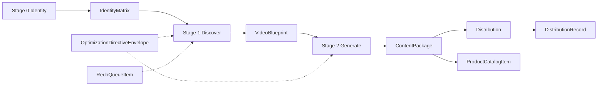

# Pipeline handoffs (stage → input → output)

Lightweight map of how canonical contracts flow through the reference implementation. Artifact keys in storage mirror the object names where possible.

| Stage | Primary inputs | Primary output | Typical next step |
|--------|----------------|----------------|-------------------|
| Stage 0 — Identity | Operator / brand parameters | `IdentityMatrix`, optional `TrainingMaterialsManifest` | Persist `identity_matrix`; run discovery |
| Stage 1 — Discover | `IdentityMatrix`, optional directives / redo items | `VideoBlueprint`, plus research rows (`TrendingAudioItem`, `CompetitorWatchItem`) | Persist `video_blueprint`; run generation |
| Stage 2 — Generate | `IdentityMatrix`, `VideoBlueprint` | `ContentPackage` | Publish or hand to distribution worker |
| Distribution | `ContentPackage` | `DistributionRecord` | Metrics, feedback loops |
| Optimization | Metrics / ops | `OptimizationDirectiveEnvelope` | Targeted replays of stage 1–3 |
| Redo queue | Policy or QA signals | `RedoQueueItem` | Re-run blueprint or package |
| Commerce | Catalog sync | `ProductCatalogItem` | Injected into scripts / captions in upstream stages |

Supporting types (`Envelope`, `MediaAssetRef`, enums in `pipeline_contracts.models.enums`) compose the top-level models but are not separate pipeline stages.

For field-level requirements and versioning, see [Handoff: m1t1](../handoffs/m1t1.md).
